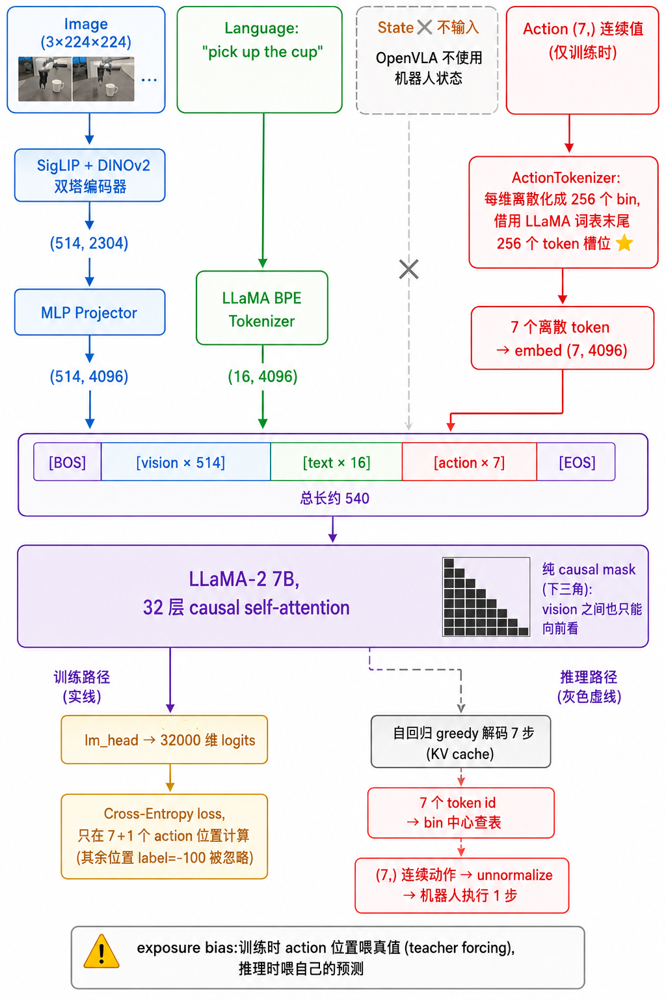
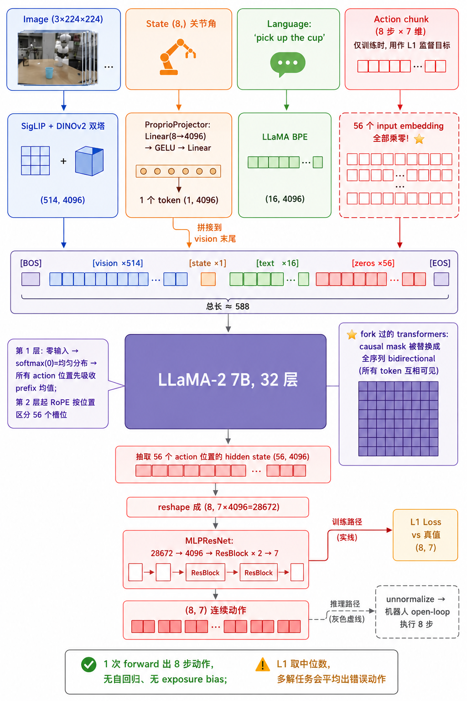
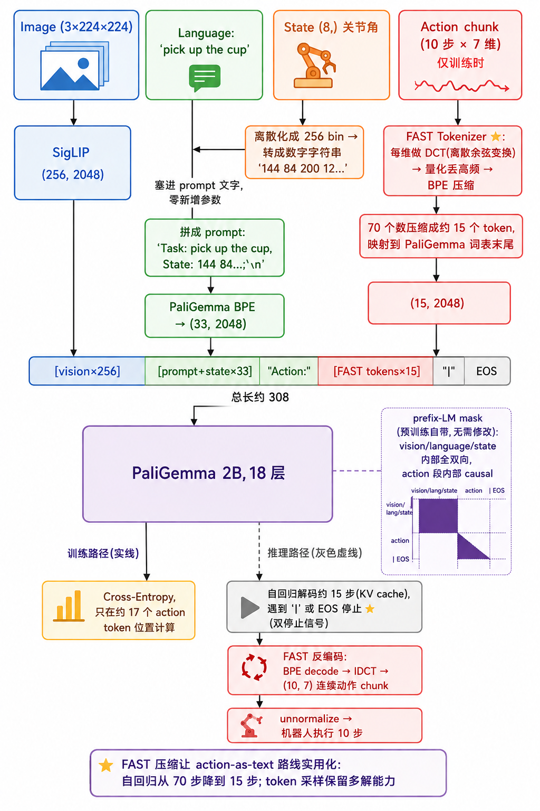
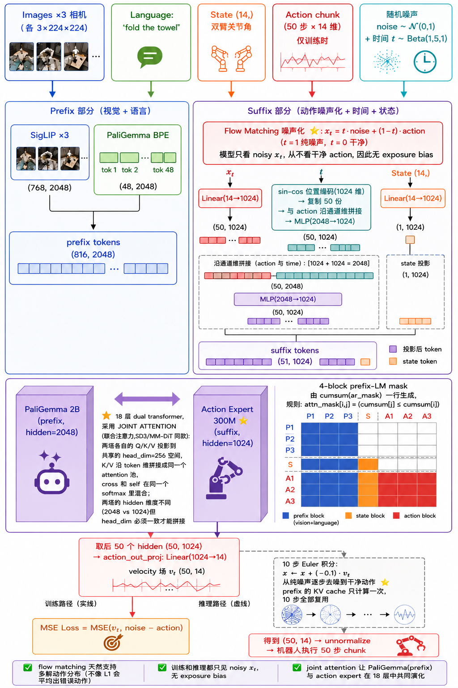
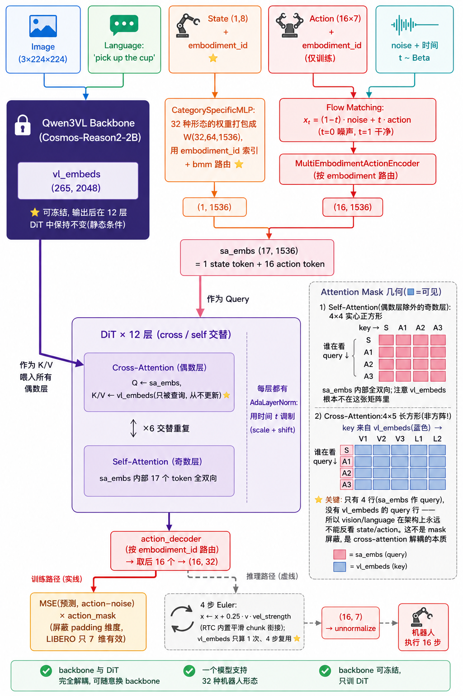

# 五种 VLA 的同一道题:image / language / state / action 怎么变成 action — OpenVLA、OFT、pi0-FAST、pi0、GR00T 全对照 / Five VLAs, one problem: turning image / language / state / action into actions — OpenVLA, OFT, pi0-FAST, pi0, GR00T side by side

> **一句话 / In one line**: 五个模型解的是同一道题,差异全在四个决策点上:**(1) state 怎么进**(不进 / 1 个 projector token / 数字字符串 / Linear token / embodiment 路由 MLP);**(2) action 用什么表示**(256-bin 离散 token / 零占位 / DCT+BPE 压缩 token / noisy 连续向量);**(3) 模态怎么融合**(causal self-attn / fork 成 bidirectional / prefix-LM / dual-transformer KV 共享 / cross-attention DiT);**(4) 怎么解码 + 监督**(自回归 CE / 一次 L1 回归 / 自回归 CE / 10 步 Euler flow matching / 4 步 Euler flow matching)。 / All five models solve the same problem; every difference lives in four decisions: **(1) how state enters** (absent / one projector token / digit string / linear token / embodiment-routed MLP); **(2) how action is represented** (256-bin discrete tokens / zero placeholders / DCT+BPE compressed tokens / noisy continuous vectors); **(3) how modalities fuse** (causal self-attn / forked bidirectional / prefix-LM / dual-transformer KV sharing / cross-attention DiT); **(4) how to decode + supervise** (autoregressive CE / one-shot L1 / autoregressive CE / 10-step Euler flow matching / 4-step Euler flow matching).

## 为什么重要 / Why this matters

过去几天我们逐一拆完了五个代表性 VLA 的源码。单独看每一个都像一堆工程细节;放在一起看,会发现它们是**同一道题的五份答卷**,而且答卷之间有清晰的演化逻辑:OpenVLA 证明"LM 训练栈直接可用"→ OFT 修掉它的推理慢和 exposure bias → pi0-FAST 把 "action as text" 压缩到实用 → pi0 干脆放弃 text 用 flow matching → GR00T 把 head 跟 backbone 解耦顺便支持多机器人形态。**把五个模型放进同一张"数据 × 操作"对照表,你设计自己 nanoVLA 时的每一个决策点都有了五个现成参考答案**。

Over the past days we dissected five representative VLAs line by line. Each alone looks like a pile of engineering details; together they are **five answer sheets to the same exam**, with a clear evolutionary logic: OpenVLA proved "the LM training stack just works" → OFT fixed its slow inference and exposure bias → pi0-FAST compressed "action as text" until it became practical → pi0 dropped text entirely for flow matching → GR00T decoupled the head from the backbone and added multi-embodiment support. **Putting all five into one "data × operations" table gives you five reference answers for every design decision in your own nanoVLA**.

## 统一框架:四个决策点 / The unified framework: four decision points

任何 VLA 的数据流都可以拆成同样的四段:

```
 image ─┐
 language ─┤→ [决策3: 融合机制] → hidden states → [决策4: 解码+监督] → action
 state ──┤      ↑                                       ↑
 action ─┘   [决策1: state 入口]                    [决策2: action 表示]
 (训练时)
```

下面按模型逐一过这四个决策点,每个模型给一张"数据流胶囊图"+ 一张"pipeline 形状变化总览"。

---

## 模型 1:OpenVLA — "动作就是 7 个冷门字" / OpenVLA — "actions are 7 rare words"



**backbone**: LLaMA-2 7B + SigLIP+DINOv2 双塔融合(channel 维 concat,2304 → projector → 4096)

```
INPUT:  image (224²)      language               state: ❌ 不输入!     action (7,)
          ↓                  ↓                                            ↓
       SigLIP+DINOv2      LLaMA BPE                              ActionTokenizer:
       → 514 patch        → ~16 tokens                           每维 256-bin 离散化
       → projector                                               → 借 vocab 末尾 7 个 token id
          ↓                  ↓                                            ↓
       ┌─────────────────────────────────────────────────────────────────┐
       │ [BOS][vision×514][..text..][T1..T7][EOS]    一条序列              │
       │ LLaMA 32 层 causal self-attention(纯下三角 mask)                │
       └─────────────────────────────────────────────────────────────────┘
          ↓
       lm_head → 32000 维 logits
       训练: labels 前 ~531 位填 -100,CE 只在 7+1 个 action 位置算(标准 HF ForCausalLMLoss)
       推理: greedy 自回归 7 步(KV cache),token id → bin → 连续值
```

- **决策1 state**: 不输入(`load_proprio=False`),靠图"看"夹爪状态
- **决策2 action**: 256-bin 离散 token,teacher forcing 喂真值
- **决策3 融合**: 纯 causal mask 的几何 — vision 钉 prefix 被单向吸,action 钉 suffix 看到全部
- **决策4 解码**: 自回归 next-token-prediction,**训练=7 个 CE 并行算,测试=7 步串行 decode → exposure bias**

### Pipeline 形状变化总览 / Shape flow at a glance

```
image (3, 224, 224)
  → SigLIP+DINOv2 双塔各 (257, 1152), channel cat → (514, 2304)
  → MLP projector → (514, 4096)

"What action should the robot take to pick up the cup?"
  → LLaMA BPE → (~16,) int → embed lookup → (16, 4096)

action (7,) float ∈ [-1,1]
  → np.digitize 256 bins → 7 个 bin id → vocab_size - bin → 7 token id
  → decode 成字符串拼进 prompt → 重新 BPE → embed → (7, 4096)

torch.cat → multimodal_embeddings (≈540, 4096)
  → LLaMA-2 7B × 32 层 causal self-attn → (540, 4096)
  → lm_head (4096 → 32000) → logits (540, 32000)

训练: shift-by-1 + IGNORE_INDEX → CE 在 8 个位置 → scalar loss
推理: argmax 最后一位 → 1 token → 循环 7 次 → (7,) token id
  → vocab_size - id → bin → bin_centers 查表 → (7,) ∈ [-1,1]
  → unnormalize → 7-DoF 物理动作 × 1 步
```

## 模型 2:OpenVLA-OFT — "把 LLaMA 改造成位置查询编码器" / OFT — "LLaMA as a position-only query encoder"



**backbone**: 同 OpenVLA,但**通过 fork 的 transformers(commit `bc339d9`)把 causal mask 换成全序列 bidirectional**(取原 mask 最后一行 broadcast D 遍,保留 pad 屏蔽 + `is_causal=False`)

```
INPUT:  image (224²)    language        state (8,)            action (8,7) chunk
          ↓                ↓               ↓                       ↓
       SigLIP+DINOv2    LLaMA BPE     ProprioProjector       56 个位置的 input
       → 514 patch                    Linear(8→4096)         embedding 全部乘零!
          ↓                ↓          → 1 个 token                ↓
       ┌──────────────────────────────────────────────────────────────────┐
       │ [BOS][vision×514][proprio×1][..text..][zeros×56][EOS]            │
       │ LLaMA 32 层 — mask 已 fork 成全 bidirectional                     │
       │ 第1层: softmax(q=0)=uniform → 全部 action 位置 = mean(V_prefix)   │
       │ 第2层起: RoPE 让 56 个位置按相对位置分化                            │
       └──────────────────────────────────────────────────────────────────┘
          ↓ 取 56 个 action 位置的 last hidden (B,56,4096)
       reshape (B,8,7×4096) → MLPResNet(28672→4096→7) → (B,8,7) 连续动作
       训练: L1 loss(labels 只用来定位 action 位置,HF CE 完全不用)
       推理: 1 次 forward 出 8 步 — 无自回归、无 exposure bias
```

- **决策1 state**: 1 个 ProprioProjector token,append 到 vision prefix 末尾
- **决策2 action**: **零向量占位**,信息全靠 attention 从 prefix 吸
- **决策3 融合**: fork 出来的全 bidirectional mask + zero embedding 两件套
- **决策4 解码**: MLPResNet 一次 L1 回归;**代价是 L1 取中位数,多 mode 任务会平均出"撞墙"**

### Pipeline 形状变化总览 / Shape flow at a glance

```
image (3, 224, 224)
  → SigLIP+DINOv2 → (514, 2304) → projector → (514, 4096)

state (8,)
  → ProprioProjector: Linear(8→4096) → GELU → Linear(4096→4096) → (1, 4096)
  → cat 到 vision patch 末尾 → 扩展 prefix (515, 4096)

language → BPE → (16,) → embed → (16, 4096)

action chunk (8, 7) — 只用于:
  (a) 56 个 token id 占住 input_ids 的位置(识别用)
  (b) (8, 7) 连续真值留给 L1 loss
56 个 action 位置的 input embedding × ~mask → (56, 4096) 全零

torch.cat → (≈588, 4096)
  → LLaMA 32 层(fork bidirectional mask)→ last_hidden (588, 4096)
  → 抽 action 位置 → actions_hidden (56, 4096)
  → reshape (8, 7×4096=28672)
  → MLPResNet: LN → Linear(28672→4096) → ReLU → ResBlock×2 → LN → Linear(4096→7)
  → predicted_actions (8, 7)

训练: L1Loss((8,7), GT (8,7)) → scalar
推理: 同 forward 1 次 → (8, 7) → unnormalize → 8 步动作 open-loop 执行
```

## 模型 3:pi0-FAST — "action as text 的成熟形态" / pi0-FAST — "action-as-text, matured"



**backbone**: PaliGemma 2B(原生 prefix-LM,无需改 mask)+ SigLIP

```
INPUT:  image (224²)    language + state                        action (10,7) chunk
          ↓                ↓                                       ↓
       SigLIP           state 离散化成数字串塞 prompt:           FAST tokenizer:
       → 256 patch      "Task: pick.., State: 144 84 ..;\n"     每维 DCT → 量化丢高频
       → 2048           → PaliGemma BPE ~33 tokens              → BPE 压缩 → ~15 tokens
          ↓                ↓                                     → 映射 PaliGemma vocab 末尾
       ┌──────────────────────────────────────────────────────────────────┐
       │ [vision×256][prompt+state ~33]["Action:"][FAST×15]["|"][EOS]      │
       │ prefix-LM mask: prefix 内部 bidirectional,action 段 causal        │
       │ (ar_mask + cumsum trick / lerobot 用 segment 显式循环)            │
       └──────────────────────────────────────────────────────────────────┘
          ↓
       lm_head → CE 只在 postfix ~17 个位置算(同 OpenVLA 思路)
       推理: 自回归 ~15 步(KV cache),停止信号 "|"+EOS 双保险
             openpi 用 EOS 在 lax.while_loop early-stop
             lerobot 死跑 max_steps 后 detokenize 时按 "|" 截断(torch.compile 友好)
       detokenize: BPE decode → IDCT → (10,7) 连续 chunk
```

- **决策1 state**: 离散化成"144 84 200..."数字串**塞进 prompt 文字**,零新参数
- **决策2 action**: DCT+BPE 双重压缩,70 个数 → ~15 token,让自回归实用化
- **决策3 融合**: 复用 PaliGemma 预训练的 prefix-LM mask — vision↔language↔state 全双向,免费
- **决策4 解码**: 自回归 CE;token 采样天然 multi-modal(OFT-L1 没有的能力)

### Pipeline 形状变化总览 / Shape flow at a glance

```
image (3, 224, 224)
  → SigLIP-So400m + projector → (256, 2048)

state (8,) ∈ [-1,1]
  → np.digitize 256 bins → (8,) int → " ".join → "144 84 200 12 33 188 55 91"
  → 拼进 prompt 字符串 "Task: pick up.., State: 144 84 ..;\n"
  → PaliGemma SentencePiece BPE → (~33,) int → embed → (33, 2048)

action chunk (10, 7)
  → FAST: 每维 DCT(10,) → 量化丢高频 → 拍平 → 学习的 BPE 压缩 → (~15,) int
  → 映射 vocab 末尾: id = vocab_size - 1 - 128 - fast_token
  → "Action: "(2) + 15 + "|"+EOS(2) = postfix (~19,) → embed → (19, 2048)

cat → (≈308, 2048)
  → PaliGemma 2B × 18 层 prefix-LM attention → (308, 2048)
  → lm_head (2048 → 257152) → logits

训练: shift-by-1 + loss_mask → CE 在 ~17 个 postfix 位置 → scalar
推理: prefill (vision+prompt) → KV cache → 自回归 ~15 步,逐 token argmax
  → 遇 "|"/EOS 停 → (~15,) token → 反映射 FAST id → BPE decode → IDCT
  → (10, 7) ∈ [-1,1] → unnormalize → 10 步动作 chunk
```

## 模型 4:pi0 — "VLM + 并行 action expert + flow matching" / pi0 — "VLM + parallel action expert + flow matching"



**backbone**: PaliGemma 2B(prefix)+ **独立 300M action expert**(suffix),dual transformer

```
INPUT:  image×3 cams    language        state (14,)        action (50,14) chunk
          ↓                ↓               ↓                    ↓ (训练时)
       SigLIP           PaliGemma       state_proj         flow matching 噪声化:
       → 768 patch      BPE → 48        Linear(14→1024)    t~Beta(1.5,1), x_t = t·noise+(1-t)·a
       → 2048           → 2048          → 1 token           u_t = noise - a (target)
          ↓                ↓               ↓                    ↓
                                                          action_in_proj(x_t) → 50 tokens
                                                          time → sin-cos(前512 sin/后512 cos,
                                                          频率在各自一半内从高到低) → MLP
                                                          → concat 进 action (pi0) 或
                                                            adaRMS 每层调制 (pi0.5)
       ┌──────────────────────────────────────────────────────────────────┐
       │ prefix [vision+language ×816] @2048  ←→  suffix [state+action ×51] @1024 │
       │ 4-block mask (ar_mask+cumsum): prefix 双向 | state | action 内部双向 │
       │ 18 层 dual transformer:各自 Q/K/V proj 投到共享 head_dim=256        │
       │ (Expert 是 non-standard MHA: 8×256=2048 > hidden 1024)             │
       │ K/V 在 head_dim 层 cat 共享,出 attention 后各回各的 hidden          │
       └──────────────────────────────────────────────────────────────────┘
          ↓ suffix 后 50 个 hidden (B,50,1024)
       action_out_proj → v_t (B,50,14) velocity
       训练: MSE(v_t, noise - actions) — 模型从不看干净 action,无 exposure bias
       推理: 10 步 Euler, x ← x + (-0.1)·v_t, prefix KV cache 复用
```

- **决策1 state**: 直接连续值过 Linear,1 个 token 进 suffix(不离散化)
- **决策2 action**: noisy 连续向量 `x_t` 本体作为 token 内容,time 注入告知噪声水平
- **决策3 融合**: dual transformer joint attention — prefix/suffix 在 head_dim=256 共享 attention pool,在 hidden(2048/1024)各自独立;**prefix 18 层持续自我演化**(与 GR00T 的关键区别)
- **决策4 解码**: 10 步 Euler 从纯噪声积分到干净 chunk;flow matching 天然 multi-modal、训练测试一致

### Pipeline 形状变化总览 / Shape flow at a glance

```
images 3× (3, 224, 224)
  → SigLIP-So400m 各 → (256, 2048) ×3 → cat → (768, 2048)
language → PaliGemma BPE → (48,) → embed → (48, 2048)
prefix_tokens = cat → (816, 2048)    ar_mask = [F]×816(一个 block,内部双向)

state (14,) → state_proj Linear(14→1024) → (1, 1024)    ar_mask += [T]

训练时噪声化:
  noise ~ N(0,I) (50, 14);  t ~ Beta(1.5,1)·0.999+0.001 (scalar)
  x_t = t·noise + (1-t)·actions → (50, 14);  u_t = noise - actions → (50, 14)

x_t → action_in_proj Linear(14→1024) → (50, 1024)
t → posemb_sincos → (1024,) → repeat → (50, 1024)
  → cat channel 维 → (50, 2048) → MLP(2048→1024→1024) → (50, 1024)
suffix_tokens = cat(state, action) → (51, 1024)    ar_mask += [T, F×49]

4-block mask: cumsum(ar_mask) → attn_mask (867, 867)

dual transformer × 18 层:
  prefix (816, 2048) → paligemma Q/K/V proj (8 heads × 256) → (816, 8, 256)
  suffix (51, 1024) → expert Q/K/V proj (8 heads × 256) → (51, 8, 256)
  K/V cat → (867, ·, 256) → attention(共享 pool, mask 控制方向)
  → O proj 各回各的 hidden → prefix (816, 2048) / suffix (51, 1024)

suffix_out[-50:] (50, 1024) → action_out_proj Linear(1024→14) → v_t (50, 14)

训练: MSE(v_t, u_t) → scalar
推理: x=noise (50,14), t=1.0;循环 10 次:
  embed_suffix(state, x, t) → forward(prefix KV cache 复用) → v_t
  x ← x + (-0.1)·v_t, t ← t - 0.1
→ x_0 (50, 14) → unnormalize → 50 步动作 chunk
```

## 模型 5:GR00T-N1.7 — "frozen backbone + cross-attention DiT + 多 embodiment" / GR00T — "frozen backbone + cross-attention DiT + multi-embodiment"



**backbone**: Qwen3VL 2B(Cosmos-Reason2)→ vl_embeds 作为**静态 condition**

```
INPUT:  image    language     state (1,8) + embodiment_id      action (16,7) + embodiment_id
          ↓         ↓             ↓                                ↓ (训练时)
       ┌─ Qwen3VL backbone ─┐  CategorySpecificMLP            flow matching(方向与 pi0 相反!):
       │ vision+language     │  W(32,64,1536) 按               x_t = (1-t)·noise + t·a (t=0 噪声)
       │ prefix-LM 内部融合  │  bmm(x, W[emb_id]) 路由         velocity = a - noise
       └→ vl_embeds          │  → 1 token @1536                   ↓
          (B,~265,2048)      │                                MultiEmbodimentActionEncoder:
          12 层 DiT 全程不变!│                                W1(a)+sincos(t) concat→W2 swish→W3
                                                              → 16 tokens @1536
       ┌──────────────────────────────────────────────────────────────────┐
       │ sa_embs = [state×1 + action×16] @1536 ← DiT 的 query              │
       │ 12 层 DiT: 偶数层 cross-attn(Q=sa, K/V=vl_embeds, mask=None)      │
       │            奇数层 self-attn(17 token 内部全双向, mask=None)        │
       │ AdaLayerNorm(scale+shift, 无 gate)每层注入 time                   │
       │ AlternateVLDiT 变体: cross 层隔层切换 只看image / 只看text mask     │
       └──────────────────────────────────────────────────────────────────┘
          ↓ 取后 16 个 → action_decoder[embodiment_id] → (B,16,32)
       训练: MSE(pred, velocity) × action_mask(屏蔽 padded 的 25 维)
       推理: 4 步 Euler, x ← x + dt·v·vel_strength(RTC 内置), vl_embeds 只算 1 次
```

- **决策1 state**: `CategorySpecificMLP` — 32 种 embodiment 的 MLP 打包成 `W(32,in,out)`,`bmm + indexing` 路由
- **决策2 action**: noisy 连续向量(同 pi0),但编码器也按 embodiment 路由
- **决策3 融合**: **pure cross-attention** — vl_embeds 是印刷好的教科书,12 层 DiT 反复查询但从不更新它;backbone 可 frozen、可随意更换
- **决策4 解码**: 4 步 Euler + action_mask 多 embodiment 屏蔽 + RTC 平滑 chunk 接缝

### Pipeline 形状变化总览 / Shape flow at a glance

```
image + language
  → Qwen3VL(SigLIP-like vision + Qwen3 LLM, prefix-LM 内部融合)
  → vl_embeds (~265, 2048)
  → vlln LayerNorm + 可选 vl_self_attention → finalized,12 层 DiT 全程复用

state (1, 8) → view (1, 64 padded)
  → CategorySpecificMLP: bmm(x, W1[emb_id]) → ReLU → bmm(·, W2[emb_id])
  → state_features (1, 1536)

训练时噪声化(方向与 pi0 相反):
  noise (16, 32 padded);  t ~ Beta·noise_s (scalar)
  x_t = (1-t)·noise + t·actions → (16, 32);  velocity = actions - noise
  t_discretized = (t×1000).long()

x_t → W1[emb_id] → a_emb (16, 1536)
t_discretized → broadcast (16,) → SinusoidalPositionalEncoding → tau_emb (16, 1536)
  → cat channel 维 → (16, 3072) → W2[emb_id]+swish → W3[emb_id] → (16, 1536)
  → + position_embedding(可选)
sa_embs = cat(state, action) → (17, 1536)

DiT × 12 层(temb = TimestepEncoder(t) → (1536,)):
  偶数层 cross-attn:
    Q = q_proj(AdaLN(sa, temb)) → (17, 8×64=512)
    K/V = k/v_proj(vl_embeds @2048) → (265, 512)
    softmax(QK^T)V → o_proj → (17, 1536), residual + FFW
  奇数层 self-attn: 17×17 全双向, mask=None
  → (17, 1536)

输出: AdaLN(norm_out×(1+scale)+shift) → proj_out → action_decoder[emb_id]
  → (17, 32) → 取后 16 → pred (16, 32)

训练: MSE(pred, velocity) × action_mask(只 7 维有效)→ masked mean → scalar
推理: x=noise (16,32);循环 4 次(dt=0.25):
  action_encoder(x, t, emb_id) → sa_embs → DiT(sa, vl_embeds 复用) → v
  x ← x + 0.25·v·vel_strength(RTC: frozen/ramp/free 分段)
→ (16, 32) → action_mask → (16, 7) → unnormalize → 16 步动作 chunk
```

---

## 总对照表 / The grand comparison table

| 决策点 | OpenVLA | OpenVLA-OFT | pi0-FAST | pi0 | GR00T-N1.7 |
|---|---|---|---|---|---|
| **backbone** | LLaMA-2 7B | LLaMA-2 7B (fork) | PaliGemma 2B | PaliGemma 2B + expert 300M | Qwen3VL 2B + DiT |
| **vision 塔** | SigLIP+DINOv2 双塔 | 同左 | SigLIP | SigLIP ×多相机 | Qwen3VL 内置 |
| **① state 入口** | ❌ 不输入 | ProprioProjector → 1 token | 离散化数字串塞 prompt | Linear → 1 token | CategorySpecificMLP(按 embodiment 路由) |
| **② action 表示** | 256-bin 离散 token ×7 | **零向量占位** ×56 | DCT+BPE token ×~15 | noisy 连续 x_t ×50 | noisy 连续 x_t ×16(embodiment 路由编码) |
| **③ 融合机制** | causal self-attn | **fork 成 bidirectional** + zero | prefix-LM(原生复用) | **joint attention**(KV 在 head_dim=256 共享) | **pure cross-attention**(vl_embeds frozen) |
| **VL 在融合中是否演化** | ✅ | ✅ | ✅ | ✅ prefix 18 层持续演化 | ❌ 静态 condition |
| **time 注入** | — | — | — | concat+MLP(pi0)/ adaRMS(pi0.5) | sincos concat + AdaLN 双路径 |
| **④ 训练目标** | CE(7 位,IGNORE_INDEX mask) | L1 | CE(~17 位) | flow matching MSE | flow matching MSE × action_mask |
| **④ 推理** | 自回归 7 步 | **1 次 forward** | 自回归 ~15 步 + "|"/EOS 停止 | 10 步 Euler(t:1→0) | 4 步 Euler(t:0→1)+ RTC |
| **exposure bias** | ❌ 有 | ✅ 无(零占位) | ❌ 有(被 FAST 压短缓解) | ✅ 无(训练只见 noisy x_t) | ✅ 无 |
| **multi-modal 动作分布** | ✅(token 采样) | ❌ L1 取中位数 | ✅ | ✅✅ flow matching | ✅✅ |
| **多 embodiment** | ❌ | ❌ | ❌ | ❌ | ✅ CategorySpecific 路由 |
| **换 backbone 难度** | — | 难(fork 绑死) | 难 | 难(head_dim 必须一致) | **容易**(只需 cross_attention_dim) |
| **backbone 可 frozen** | ❌ | ❌ | ❌ | 不便(KV 共享漏梯度) | ✅ |

## 五种 mask 几何直观对照 / The five mask geometries, visualized

用同一套玩具尺寸把五个模型的 mask 摆在一起:**3 个 vision (V)、2 个 language (L)、1 个 state (S,如果该模型有)、3 个 action (A)**。约定:**行 = query(谁在看),列 = key(被看的)**;`■` = 可见,`·` = 被屏蔽(softmax 前加 -inf)。

Same toy layout for all five: **3 vision (V), 2 language (L), 1 state (S where present), 3 action (A)**. Convention: **row = query (who is looking), column = key (being looked at)**; `■` = visible, `·` = blocked (-inf before softmax).

### ① OpenVLA — 纯 causal(下三角) / pure causal (lower triangle)

序列 `[V V V L L A A A]`(无 state):

```
 看→     V1 V2 V3 L1 L2 A1 A2 A3
 V1      ■  ·  ·  ·  ·  ·  ·  ·
 V2      ■  ■  ·  ·  ·  ·  ·  ·
 V3      ■  ■  ■  ·  ·  ·  ·  ·
 L1      ■  ■  ■  ■  ·  ·  ·  ·
 L2      ■  ■  ■  ■  ■  ·  ·  ·
 A1      ■  ■  ■  ■  ■  ■  ·  ·     ← A 只能看到"前面的"A(causal)
 A2      ■  ■  ■  ■  ■  ■  ■  ·
 A3      ■  ■  ■  ■  ■  ■  ■  ■
```

要点:**vision 之间也是 causal 的**(V1 看不到 V2!),language 看不到 action,action 内部只能向前看 — 这就是 exposure bias 的几何来源。HF `create_causal_mask` 自动生成,OpenVLA 一行没改。

Key point: **even vision is causal internally** (V1 can't see V2!), language can't see action, actions only look backward — the geometric root of exposure bias. Auto-generated by HF `create_causal_mask`, OpenVLA changes nothing.

### ② OpenVLA-OFT — 全 bidirectional(fork 改造) / full bidirectional (forked)

序列 `[V V V S L L Z Z Z]`(Z = 置零的 action 占位):

```
 看→     V1 V2 V3 S  L1 L2 Z1 Z2 Z3
 V1      ■  ■  ■  ■  ■  ■  ■  ■  ■
 V2      ■  ■  ■  ■  ■  ■  ■  ■  ■
 V3      ■  ■  ■  ■  ■  ■  ■  ■  ■
 S       ■  ■  ■  ■  ■  ■  ■  ■  ■
 L1      ■  ■  ■  ■  ■  ■  ■  ■  ■
 L2      ■  ■  ■  ■  ■  ■  ■  ■  ■
 Z1      ■  ■  ■  ■  ■  ■  ■  ■  ■     ← 全 1!所有人看所有人
 Z2      ■  ■  ■  ■  ■  ■  ■  ■  ■        (只有 padding 列是 ·)
 Z3      ■  ■  ■  ■  ■  ■  ■  ■  ■
```

要点:fork 的 transformers 用"取原 causal mask 最后一行 broadcast D 遍"的 trick 把下三角抹平。**vision 能看 language 和 action 了** — 但 action 位置 input 是零,被看到也没信息;真正受益的是 action 之间的双向交流。

Key point: the forked transformers flattens the triangle by broadcasting the original mask's last row D times. **Vision can now see language and action** — but action inputs are zeros so there's nothing to leak; the real win is bidirectional exchange among action positions.

### ③ pi0-FAST — prefix-LM(双向前缀 + causal 尾巴) / prefix-LM (bidirectional prefix + causal tail)

序列 `[V V V P P A A A]`(P = prompt 文字,**state 数字串就在 P 里**;A = FAST action token):

```
 看→     V1 V2 V3 P1 P2 A1 A2 A3
 V1      ■  ■  ■  ■  ■  ·  ·  ·
 V2      ■  ■  ■  ■  ■  ·  ·  ·     ← prefix 内部全双向:
 V3      ■  ■  ■  ■  ■  ·  ·  ·        vision 能看 language(和藏在里面的 state)!
 P1      ■  ■  ■  ■  ■  ·  ·  ·
 P2      ■  ■  ■  ■  ■  ·  ·  ·
 A1      ■  ■  ■  ■  ■  ■  ·  ·     ← action 尾巴内部 causal
 A2      ■  ■  ■  ■  ■  ■  ■  ·        (自回归生成需要)
 A3      ■  ■  ■  ■  ■  ■  ■  ■
```

要点:左上角是一个**实心方块**(prefix 双向),右下角是一个**小下三角**(action causal)。这是 PaliGemma 预训练自带的形状,pi0-FAST 用 `cumsum(ar_mask)` 一行复现,完全不改权重。对比 ①:vision↔language 从单向变双向,是 OpenVLA 需要 FiLM 才能补上的能力。

Key point: a **solid square** top-left (bidirectional prefix) plus a **small lower triangle** bottom-right (causal action tail). This is PaliGemma's pretrained shape, reproduced by one `cumsum(ar_mask)` line. Versus ①: vision↔language goes bidirectional — the capability OpenVLA needed FiLM to patch in.

### ④ pi0 — 4-block prefix-LM(action 内部也双向) / 4-block prefix-LM (actions bidirectional too)

序列 `[V V V L L | S | A A A]`,`ar_mask = [0 0 0 0 0 | 1 | 1 0 0]`,`cumsum = [0 0 0 0 0 | 1 | 2 2 2]`:

```
 看→     V1 V2 V3 L1 L2 S  A1 A2 A3
 V1      ■  ■  ■  ■  ■  ·  ·  ·  ·
 V2      ■  ■  ■  ■  ■  ·  ·  ·  ·     ← block 0 (prefix):内部双向,
 V3      ■  ■  ■  ■  ■  ·  ·  ·  ·        看不到 state/action(VLM 不被 robot 信号污染)
 L1      ■  ■  ■  ■  ■  ·  ·  ·  ·
 L2      ■  ■  ■  ■  ■  ·  ·  ·  ·
 S       ■  ■  ■  ■  ■  ■  ·  ·  ·     ← block 1 (state):看 prefix + 自己,看不到 action
 A1      ■  ■  ■  ■  ■  ■  ■  ■  ■     ← block 2 (action):看全部,
 A2      ■  ■  ■  ■  ■  ■  ■  ■  ■        且内部全双向(A1 能看 A3!)
 A3      ■  ■  ■  ■  ■  ■  ■  ■  ■
```

要点:对比 ③,**右下角从下三角变成了实心方块** — action 内部双向。不泄露真值的原因:action 位置的内容是 noisy `x_t`,不是 ground truth。判定规则一行:`attn_mask[i,j] = cumsum[j] <= cumsum[i]`(同 block 双向,前面 block 可见,后面 block 不可见)。

Key point: versus ③, **the bottom-right corner turns from a triangle into a solid square** — actions are bidirectional internally. No ground-truth leak because action contents are noisy `x_t`. One-line rule: `attn_mask[i,j] = cumsum[j] <= cumsum[i]`.

### ⑤ GR00T — 两张分开的矩阵(cross 不是方阵!) / two separate matrices (cross isn't square!)

GR00T 没有一张统一的大 mask — self 和 cross 是**两个独立的 attention 调用**,矩阵形状都不一样:

**奇数层 self-attention**(只有 sa_embs,`mask=None`):

```
 看→     S  A1 A2 A3
 S       ■  ■  ■  ■
 A1      ■  ■  ■  ■     ← 4×4 全 1,state+action 内部全双向
 A2      ■  ■  ■  ■        (V/L 根本不在这张矩阵里!)
 A3      ■  ■  ■  ■
```

**偶数层 cross-attention**(Q 来自 sa_embs,K/V 来自 vl_embeds,`mask=None`):

```
 看→     V1 V2 V3 L1 L2      ← key 是 vl_embeds(另一个 input!)
 S       ■  ■  ■  ■  ■
 A1      ■  ■  ■  ■  ■     ← 4×5 非方阵:sa 单向查询 vl,
 A2      ■  ■  ■  ■  ■        vl 没有 query 行 — 架构上 V/L 永远不能看 S/A
 A3      ■  ■  ■  ■  ■
```

**AlternateVLDiT 变体**(cross 层隔层切换列屏蔽):

```
 只看 text 的层:                 只看 image 的层:
 看→     V1 V2 V3 L1 L2          看→     V1 V2 V3 L1 L2
 S       ·  ·  ·  ■  ■           S       ■  ■  ■  ·  ·
 A1      ·  ·  ·  ■  ■           A1      ■  ■  ■  ·  ·
 A2      ·  ·  ·  ■  ■           A2      ■  ■  ■  ·  ·
 A3      ·  ·  ·  ■  ■           A3      ■  ■  ■  ·  ·
         ↑ image 列整列屏蔽               ↑ text 列整列屏蔽
         (防止 256 个 image token 淹没 9 个 text token)
```

要点:①-④ 都是"一张方阵 + 用 mask 划分区域",GR00T 是"**根本不放进同一张矩阵**" — V/L 看不到 S/A 不是 mask 屏蔽出来的,而是**架构上 vl_embeds 从来不产生 query**。这就是 cross-attention "解耦"的几何本质。

Key point: ①-④ are all "one square matrix partitioned by a mask"; GR00T simply **never puts them in the same matrix** — V/L can't see S/A not because a mask blocks it, but because vl_embeds architecturally never produces queries. That is the geometric essence of cross-attention "decoupling".

### 一眼总结 / One-glance summary

```
①OpenVLA      ②OFT          ③pi0-FAST     ④pi0          ⑤GR00T
┌────────┐    ┌────────┐    ┌──────┬──┐   ┌─────┬─┬──┐   self:  cross:
│◣       │    │████████│    │██████│  │   │█████│ │  │   ┌──┐  ┌────┐
│ ◣      │    │████████│    │██████│  │   │█████│ │  │   │██│  │████│
│  ◣     │    │████████│    │██████│  │   ├─────┼─┤  │   │██│  │████│
│   ◣    │    │████████│    ├──────┼─┐│   │█████│█│  │   └──┘  └────┘
│    ◣   │    │████████│    │██████│◣││   ├─────┼─┼──┤   (4×4) (4×5
│     ◣  │    │████████│    │██████│ ◣│   │█████│█│██│    全1)  非方阵)
└────────┘    └────────┘    └──────┴──┘   └─────┴─┴──┘
下三角         全 1          方块+小三角    三块阶梯       两张分开的矩阵
causal        bidirectional  prefix-LM     4-block        cross+self 交替
```

## 演化脉络 / The evolutionary thread

```
RT-2 (2023): "action as text" 思想起点
   │
   ▼
OpenVLA (2024):开源复刻 — 证明 LM 训练栈直接可用
   │  痛点: 7 步自回归慢、exposure bias、256-bin 精度差、无 state
   │
   ├──────────────► OpenVLA-OFT (2025):
   │                fork bidirectional + 零占位 + L1 一次回归
   │                修好: 速度 7×、exposure bias、加 proprio
   │                新痛点: L1 多 mode 平均"撞墙"
   │
   ├──────────────► pi0-FAST (2025):
   │                留在 token 路线,用 DCT+BPE 把 70 数压成 15 token
   │                修好: 自回归实用化、state 零成本入 prompt、保留 multi-modal
   │
   ▼
pi0 (2024):彻底放弃 text — dual transformer + flow matching
   │  优点: multi-modal + 一致性 + 固定延迟
   │  局限: backbone-expert 焊死(head_dim 一致)、单 embodiment
   │
   ▼
GR00T-N1.7 (2025/26):cross-attention 解耦 + CategorySpecific 多 embodiment
   保留 flow matching 优点,backbone 可 frozen 可替换,一个模型多种机器人
```

## 类比 / The analogy

把"看图看指令生成动作"想象成五种学生答题方式:

- **OpenVLA**:把答案当作文来写,一个字一个字续写,写错一个字后面越错越离谱(exposure bias);
- **OFT**:卷子上印好 56 个空白格子,学生看完题一次性把所有格子填满 — 快,但每题只能写一个答案,遇到"两个都对"的题就写中间值(L1 平均);
- **pi0-FAST**:还是写作文,但先用速记法(FAST)把答案压缩成 15 个符号再写 — 写得快又保留了"可以写不同答案"的灵活性;
- **pi0**:学生(expert)和教授(PaliGemma)坐同一会议室共同演化 18 轮,学生拿着一张被噪声涂花的草稿,每轮问"往哪个方向擦干净一点"(velocity),10 轮擦完;
- **GR00T**:教授提前把讲义(vl_embeds)印好就离场,学生(DiT)拿着草稿反复翻讲义 12 次,每隔一层跟同桌对一下笔记(self-attn),而且这个学生带了 32 副"翻译眼镜"(CategorySpecificMLP),换机器人形态就换眼镜。

Imagine "look at the image, read the instruction, produce actions" as five exam-taking styles: **OpenVLA** writes the answer as an essay, one character at a time — one mistake snowballs (exposure bias). **OFT** gets a sheet with 56 pre-printed blank boxes and fills them all at once after reading — fast, but each box takes exactly one answer, so "both are correct" questions get the midpoint (L1 averaging). **pi0-FAST** still writes essays but first compresses the answer to 15 shorthand symbols (FAST) — fast to write, keeps the flexibility of writing different answers. **pi0** has the student (expert) and the professor (PaliGemma) co-evolving in one room for 18 rounds; the student holds a noise-smeared draft and asks each round "which direction do I erase?" (velocity), clean after 10 rounds. **GR00T**'s professor prints the handout (vl_embeds) and leaves; the student (DiT) re-reads it 12 times, syncing notes with a tablemate every other layer (self-attn), and carries 32 pairs of "translation glasses" (CategorySpecificMLP) — switch robots, switch glasses.

## 在 nanoVLA / nanoWAM 中的位置 / Where this lives in your nano-VLA

这是 `vlm-backbone-wiring` 槽位的**总结篇**,把前面 5 个 deep-dive(OpenVLA 6/08、OFT 6/08、pi0-FAST 6/08、pi0 6/09、GR00T 6/09)收束成一张决策地图。

**给 nanoVLA 的选型决策树**:

```
你的任务是单 mode 的吗(LIBERO 类抓放)?
 ├─ 是 → 资源紧?
 │       ├─ 是 → OFT 路线(零占位 + L1,最简单最快)
 │       └─ 否 → pi0-FAST 路线(保留 multi-modal 备用)
 └─ 否(多 mode:双臂/绕障) → 必须 flow matching
         ├─ 单一机器人 + 想要 backbone-expert 紧密协作 → pi0 路线
         └─ 多机器人形态 / 想 frozen backbone / 想换 backbone → GR00T 路线
```

**四个决策点上的"安全默认值"**(2026 年视角):
1. state 入口:**Linear → 1 token**(pi0 式),多 embodiment 才上 CategorySpecificMLP
2. action 表示:**noisy 连续向量**(flow matching),除非你强依赖现成 LM infra
3. 融合机制:小模型从头训用 **cross-attention**(解耦好调试),复用大预训练 VLM 用 **joint attention**
4. 解码:**4-10 步 Euler flow matching**;实时性极端要求(>50Hz)才退回 OFT-L1

This is the **synthesis** of the `vlm-backbone-wiring` slot, condensing the five deep-dives (OpenVLA 6/08, OFT 6/08, pi0-FAST 6/08, pi0 6/09, GR00T 6/09) into one decision map. The decision tree above and the "safe defaults" (state: Linear → 1 token; action: noisy continuous; fusion: cross-attention for from-scratch, joint attention for pretrained-VLM reuse; decoding: 4-10 step Euler flow matching, falling back to OFT-L1 only for >50Hz real-time) give a concrete starting point for any nanoVLA build.

## 注意事项 / Caveats / when it breaks

- **本表是"当下快照"** / **This table is a snapshot**: 五个 repo 都在活跃开发(GR00T-N1.7、pi0.5 都是近几个月的迭代),决策点结论稳定但具体数字(层数、维度)会变 / All five repos are under active development; the decision-point conclusions are stable but specific numbers (layers, dims) will drift.
- **flow matching 方向 convention 两家相反** / **Flow matching direction conventions differ**: pi0 是 t=1 噪声(Euler `-dt·v`),GR00T 是 t=0 噪声(Euler `+dt·v`),抄代码时极易搞混 / pi0 has t=1=noise (Euler `-dt·v`), GR00T has t=0=noise (Euler `+dt·v`) — extremely easy to confuse when porting.
- **OFT 的 bidirectional 在 fork 的 transformers 里** / **OFT's bidirectional lives in a forked transformers**: 主 repo grep 不到,在 `moojink/transformers-openvla-oft` commit `bc339d9` / Not greppable in the main repo; it's in the fork.
- **"cross-attention vs KV 共享"从 action 视角看效果接近** / **From the action token's perspective the two look similar**: 真正差异在 VL 是否被更新、参数是否解耦、能否 frozen — 选型时看工程约束而不是"哪个融合更强" / The real differences are whether VL evolves, parameter coupling, and frozen-backbone support — choose by engineering constraints, not "which fuses better".

## 延伸阅读 / Further reading

- 本系列前五篇 deep-dive:OpenVLA fusion + NTP target(6/08)、OFT zero+bidirectional + placeholder lineage(6/08)、pi0-FAST fusion + stop signals(6/08)、pi0 完整数据流(6/09)、GR00T cross-attention(6/09)
- RT-2 (Brohan et al., 2023) — action-as-text 源头
- π₀ paper / FAST paper / OpenVLA-OFT paper / GR00T-N1 paper
- Flow Matching (Lipman et al., 2023)、Rectified Flow (Liu et al., 2022)
